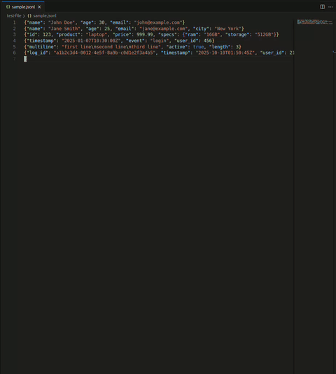

# JSONL VIEW

Fork from https://github.com/voztaka/preview-jsonl, modified for previewing any file with any suffix name as long as its content is in the jsonl format.

---

A lightweight VS Code extension for previewing JSONL (JSON Lines) files with syntax highlighting.

Note: This extension was developed based on version 0.4.1 of the following extension[https://github.com/toiroakr/jsonl-editor]. The key difference is that while jsonl-editor loads libraries from CDN, this extension was created to work in environments without internet connectivity.

## Features

- **Line-by-line Preview**: View formatted JSON for each line in a JSONL file
- **Navigation**: Easy navigation between lines with Prev/Next buttons
- **Line Jumping**: Go to specific line number
- **Copy to Clipboard**: Copy the current JSON to clipboard with one click
- **Syntax Highlighting**: Color-coded JSON with keys, strings, numbers, and literals
- **Offline Support**: Works without internet connection (no external dependencies)
- **Real-time Updates**: Preview updates automatically as you navigate through the file

## Usage

### Quick Start

1. Open a `.jsonl` file in VS Code
2. Right-click in the editor
3. Select **"Preview JSONL"** from the context menu
4. A preview panel will open on the right side showing the formatted JSON for the current line
   

### Navigation

- **Prev/Next buttons**: Navigate to previous or next line
- **Line input**: Type a line number and press Enter to jump to that line
- **Copy JSON button**: Copy the current JSON to clipboard
- **Cursor movement**: The preview automatically updates when you move your cursor in the editor

## Installation

### From VSIX File

1. Build the VSIX package:

   ```bash
   npm install
   npm run compile
   npm install -g @vscode/vsce
   vsce package
   ```

2. Install in VS Code:
   - Open VS Code
   - Go to Extensions (Ctrl+Shift+X)
   - Click the "..." menu → "Install from VSIX..."
   - Select the generated `preview-jsonl-0.0.1.vsix` file

### From Source (Development)

1. Clone the repository
2. Install dependencies:
   ```bash
   npm install
   ```
3. Press F5 to open a new VS Code window with the extension loaded

## Requirements

- VS Code version 1.102.0 or higher

## Extension Settings

This extension does not require any configuration.

## Known Issues

None at this time.

## Release Notes

### 0.0.1

Initial release:

- JSONL file preview with syntax highlighting
- Line navigation (Prev/Next, jump to line)
- Copy JSON to clipboard
- Offline support (no external dependencies)

## License

This project is licensed under the MIT License - see the [LICENSE](LICENSE) file for details.
